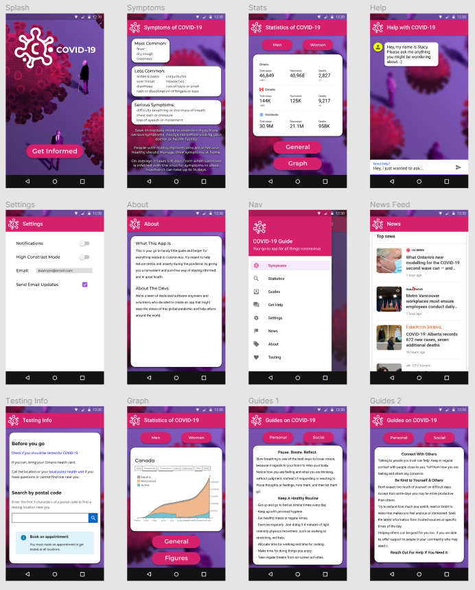

# COVID-19 App
This app is meant to help infrom you about the Covid-19 pandemic, and give you
usefull information to assist you in these troubling times. Stay safe and
connected using this appliation.

## About

This is your go to handy little guide and helper for everything related 
to Coronovirus. It’s meant to help reduce stress and anxiety during the 
pandemic by giving you a convenient and pain-free way of staying informed 
and in good health.

## Features

- COVID-19 statistics for your community
- Important, recent and breaking news feed
- Guides on how to stay healthy during the pandemic
- COVID-19 symptoms
- COVID-19 Test centers near you
- Request Help from support personell
- Clean and modern user interface

## Prototype

## Future Planning

For the future we would like to include some of the following desirable
functionalities. We couldn't find these functionalities in the top 5 apps
that we reviewed, so we think adding them will make our product better!

| Issue                                                     | Proposed Solution                                                                                                                                                               |
| --------------------------------------------------------- | ------------------------------------------------------------------------------------------------------------------------------------------------------------------------------- |
| Can't properly keep track of symptoms                     | Inside of the app, have the ability to do daily or weekly self administered symptom quizes that are logged and can be reviewed at a later date                                  |
| Want to see an updated report on the status of vaccines   | In the app, keep track of a list of current companies researching vaccines and their progress on their development                                                              |
| Want to be able to get involved as a volenteer            | Have a page in the app that presents volenteer group and initiative and allows the user to contact or sign up with these volenteer groups                                       |
| Can't track where you've been or who's been near you      | Impliment a contact tracing and tracking functionality. Alerting users if they have been in close proximity with people who may be or are infected.                             |

## Links

- [Figma Public Link](https://www.figma.com/file/9qdxCbwLOMr1S8tLRo25aT/Assign1-Brian-Mulhall?node-id=34%3A149)
- [Video Demo of Prototype](https://sheridanc-my.sharepoint.com/:v:/g/personal/mulhalbr_shernet_sheridancollege_ca/EdTqtodng81FkOEDsn-GprkB0HGmgiC-b-jJ62kTPfwjEg?e=UrZqdY)
